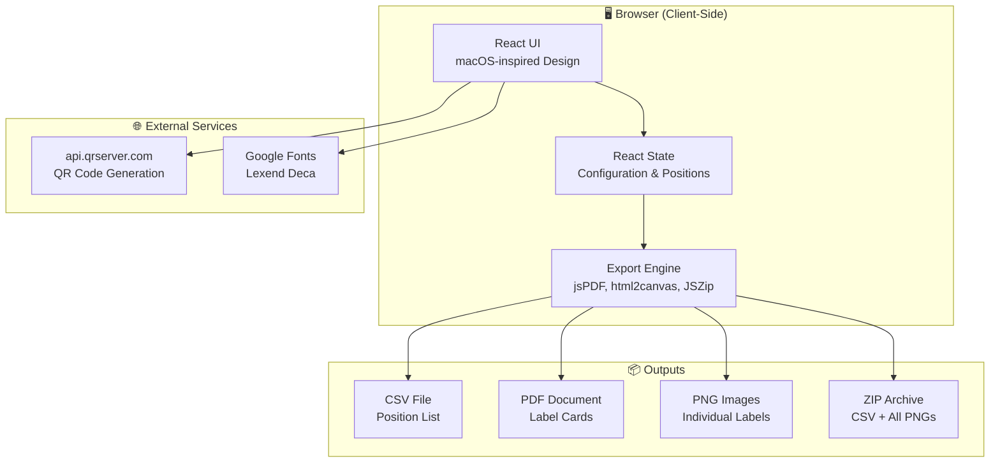

# 🏛️ Architecture & System Context

## Project Name

**QRGen Warehouse** - Warehouse Position Label Generator

## System Context

QRGen Warehouse is a client-side web application for generating QR code labels for warehouse inventory positions. It creates unique identifiers for each storage location based on a hierarchical structure: Warehouse → Rack → Level → Row.

The application runs entirely in the browser with no backend dependencies. QR codes are generated via a public API (`api.qrserver.com`), and all export operations (CSV, PDF, PNG, ZIP) are processed client-side using JavaScript libraries.

## High-Level Diagram



## Directory Structure

```
qrgen-warehouse/
├── public/
│   └── CTD.png              # Company logo for labels
├── src/
│   ├── App.jsx              # Main application component (all logic)
│   ├── index.css            # Tailwind + custom utilities
│   └── main.jsx             # React entry point
├── rag/                     # AI context & documentation
│   ├── 0-INDEX.md
│   ├── architecture.md
│   ├── tech_stack.md
│   ├── rules.md
│   ├── workflows.md
│   ├── database_structure.md
│   ├── business_logic.md
│   └── templates/
├── index.html               # HTML entry with font preloading
├── package.json             # Dependencies & scripts
├── vite.config.js           # Vite configuration
├── tailwind.config.js       # Tailwind CSS config
├── postcss.config.js        # PostCSS config
└── vercel.json              # Vercel deployment config
```

## Component Architecture

The application is a single-component architecture (`App.jsx`) containing:

| Section | Responsibility |
|---------|---------------|
| **State Management** | React useState for config, export progress, onboarding |
| **Position Calculator** | useMemo to generate all position combinations |
| **Format Helpers** | Arabic/Roman numeral conversion |
| **Export Functions** | CSV, PDF, PNG, ZIP generation |
| **Onboarding System** | First-time user guide with cookie persistence |
| **UI Rendering** | Settings panel, preview card, data table |
