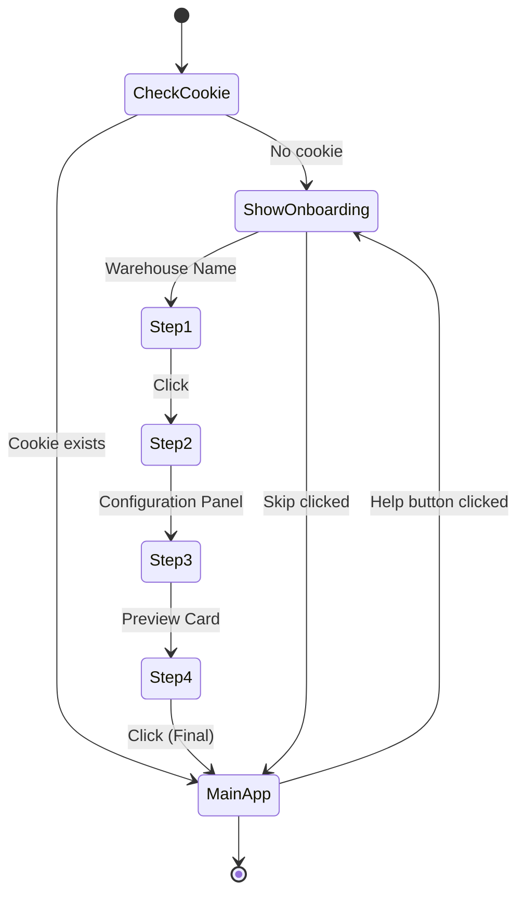
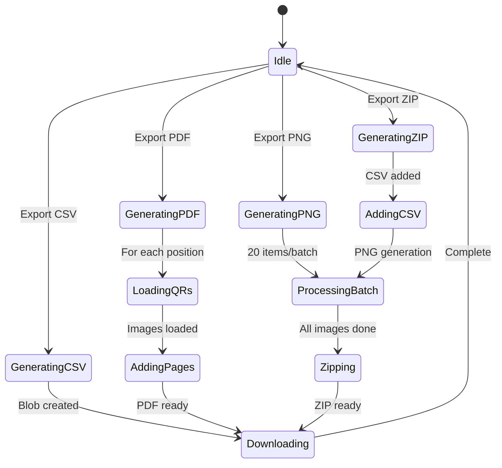

# 🧠 Business Logic

## Domain Rules

### Warehouse Position Hierarchy

```
Warehouse (Kho)
└── Rack (Kệ) [1 → N]
    └── Level (Tầng) [Top → Bottom, descending order]
        └── Row (Hàng) [1 → N]
```

### Position Code Format

```
{WarehouseName}-{Rack}-{Level}-{Row}
```

**Example**: `Kho 2(miền Nam, new)-I-04-01`

- Warehouse: `Kho 2(miền Nam, new)`
- Rack: `I` (Roman numeral for 1)
- Level: `04` (Arabic, zero-padded)
- Row: `01` (Arabic, zero-padded)

### Number Formatting

| Format | Example | Usage |
|--------|---------|-------|
| **Arabic** | `01`, `02`, `10` | Zero-padded to 2 digits |
| **Roman** | `I`, `II`, `X` | Uppercase Roman numerals |

Conversion logic in `toRoman()` function handles values 1-3999.

## Algorithms

### Position Generation Algorithm

```javascript
for (rack = 1 → racks) {
    for (level = levels → 1) {     // Descending order (top-first)
        for (row = 1 → rows) {
            generate position(rack, level, row)
        }
    }
}
```

**Key Design Decision**: Levels iterate in descending order so the highest shelf is labeled first.

### Total Positions Formula

```
Total = Racks × Levels × Rows
```

**Example**: 10 racks × 4 levels × 5 rows = **200 positions**

## State Machines

### Onboarding Flow



### Export Process Flow



## Business Constraints

| Rule | Constraint |
|------|------------|
| Min racks | 1 |
| Min levels | 1 |
| Min rows | 1 |
| Max recommended positions | ~1000 (browser memory) |
| QR code size | 150×150 px (API parameter) |
| Export batch size | 20 (prevents memory overflow) |
