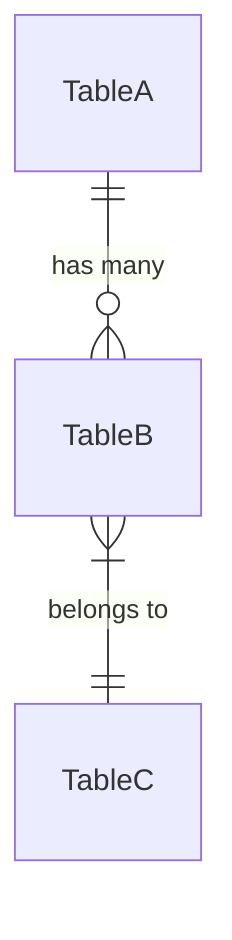

# 📄 Database Structure Template

Use this template when documenting database schemas for projects.

---

# 🗄️ Database Structure

## 1. Database Overview

| Property | Value |
|----------|-------|
| **Technology** | {PostgreSQL / MongoDB / etc.} |
| **Version** | {Version number} |
| **Connection** | {Connection string pattern} |

## 2. Database Initialization

```sql
-- Initialization script or commands
CREATE DATABASE {database_name};
```

## 3. Table/Collection Structures

### {Table/Collection Name}

**Purpose**: {Brief description of what this table stores}

| Column | Type | Constraints | Description |
|--------|------|-------------|-------------|
| `id` | UUID | PRIMARY KEY | Unique identifier |
| `field_name` | VARCHAR(255) | NOT NULL | Description |
| `created_at` | TIMESTAMP | DEFAULT NOW() | Creation timestamp |
| `updated_at` | TIMESTAMP | | Last update timestamp |

**Indexes**:
- `idx_{table}_{field}` on `{field_name}`

## 4. Relationships



## 5. Migrations

| Version | Description | Date |
|---------|-------------|------|
| 001 | Initial schema | YYYY-MM-DD |
| 002 | Add new table | YYYY-MM-DD |

## 6. Data Retention

| Table | Retention Policy |
|-------|-----------------|
| {Table} | {Policy description} |

## 7. Backup Strategy

- **Frequency**: {Daily/Hourly}
- **Method**: {Snapshot/Dump}
- **Retention**: {Number of backups kept}
