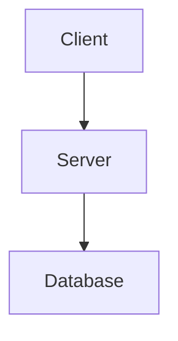

```markdown
# 📂 Project RAG Structure
# project_root/
# └── rag/
#     ├── 0-INDEX.md              <-- The "Brain" for AI navigation
#     ├── architecture.md         <-- System flows & Diagrams
#     ├── tech_stack.md           <-- Technologies & Versions
#     ├── rules.md                <-- Coding standards & AI Guidelines
#     ├── workflows.md            <-- Build, Deploy, & Scripts
#     ├── database_structure.md   <-- Tables, Schemas & Relations
#     ├── business_logic.md       <-- Algorithms & Domain Rules
#     └── templates/              <-- Blueprints for new code
#         ├── component_ui_ux.md
#         ├── readme_template.md
#         └── database_template.md

---

### 📄 FILE: rag/0-INDEX.md
# 🗺️ RAG System Index
AI Agent, use this index to retrieve the correct context for this project:

- **System Architecture**: Read `rag/architecture.md`
- **Tech Stack & Libs**: Read `rag/tech_stack.md`
- **Coding Rules & Standards**: Read `rag/rules.md`
- **Development Workflows**: Read `rag/workflows.md`
- **Database Schema**: Read `rag/database_structure.md`
- **Business Domain Logic**: Read `rag/business_logic.md`
- **Code Generation Blueprints**: Check `rag/templates/`

> **Maintenance Rule**: Any modification to the codebase must be accompanied by an update to these files to ensure the RAG context remains the single source of truth.

---

### 📄 FILE: rag/architecture.md
# 🏛️ Architecture & System Context
## Project Name
[Name project base on business logic, short, lean, 1-3 words]
## System Context
[Description of the system's boundaries and interactions]

## High-Level Diagram


## Directory Structure

* **`src/`**: Core source code
* **`rag/`**: AI context and documentation

---

### 📄 FILE: rag/tech_stack.md

# 🛠️ Tech Stack

## Core Engine

* [Framework]: [Key Framework]

## Infrastructure

---

### 📄 FILE: rag/rules.md

# 📜 Development Rules

## AI Agent Guidelines

1. **Session Start**: At the beginning of every session, read `rag/0-INDEX.md` and `rag/rules.md` first.
2. **Standard Alignment**: Ensure all generated code follows the defined naming and architectural patterns.

## Coding Standards

* **Style**: [e.g., Functional, ES6+]
* **Naming**: [e.g., PascalCase for components]

---

### 📄 FILE: rag/database_structure.md

# 🗄️ Database Structure

## 1. Database Overview

[Technology used, e.g., PostgreSQL, MongoDB]

## 2. Table Structure

### [Table Name]

| Column | Type | Description |
| --- | --- | --- |
| `id` | UUID | Primary Key |
| `field_name` | String | Description |

---

### 📄 FILE: rag/business_logic.md

# 🧠 Business Logic

## Domain Rules

## Algorithms / State Machines

---

### 📄 FILE: rag/workflows.md

# ⚙️ Workflows

## Development

* **Start**: `[Command]`
* **Test**: `[Command]`

## Deployment

* **Method**: [e.g., Docker, Vercel]

---

### 📄 FILE: rag/templates/component_ui_ux.md

# 🎨 UI/UX Component Template

## Visual Design

* **Layout/Colors**: [Description]

## Usage Example

```tsx
<Component prop={value} />

```
